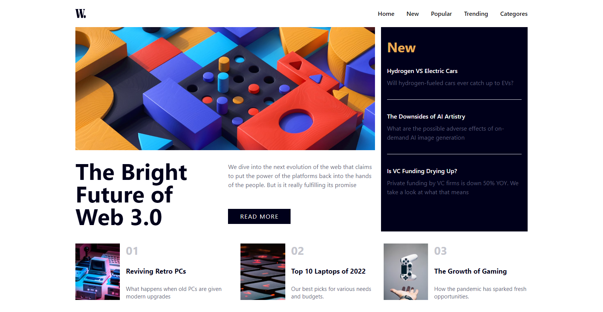
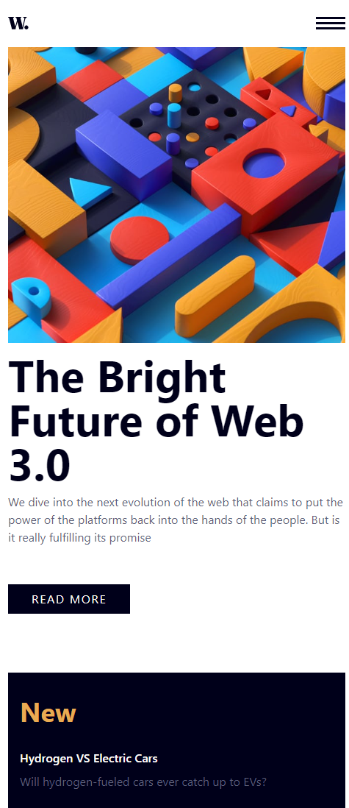

# news-homepage-main

This is a solution to the [News homepage challenge on Frontend Mentor](https://www.frontendmentor.io/challenges/news-homepage-H6SWTa1MFl). Frontend Mentor challenges help you improve your coding skills by building realistic projects. 

### The challenge

Users should be able to:

- View the optimal layout for the interface depending on their device's screen size
- See hover and focus states for all interactive elements on the page

### screenshots

- deskktop

- mobile

- navigation icon click

### Links

- Live Site URL: (https://aaronnevalinz.github.io/news-homepage-main/)

### Built with

- Semantic HTML5 markup
- tailwindcss
- Vannilla Javascript
